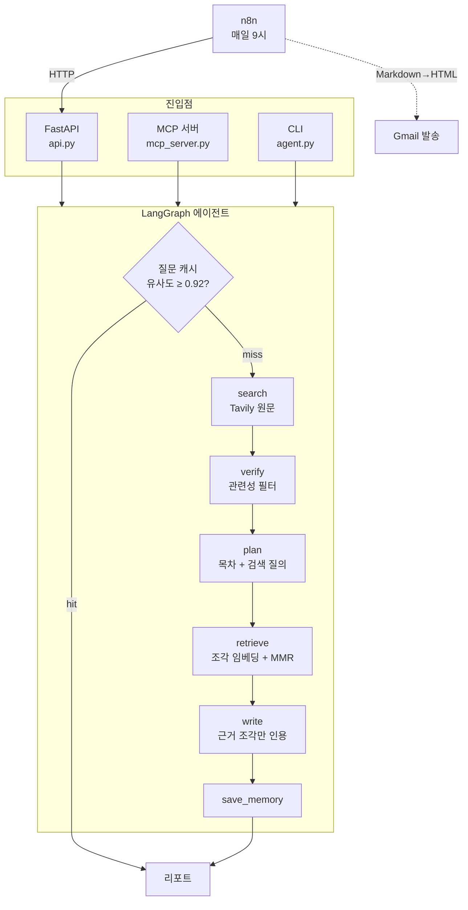

# AI Research Agent

주제를 입력하면 웹을 조사하고, **원문 근거를 인용한 리포트**를 만들어 주는 AI 에이전트입니다.
하나의 LangGraph 에이전트를 **HTTP API · MCP 서버 · n8n 자동화(매일 메일 발송)** 세 가지 방식으로 제공합니다.

**Live demo**: https://ai-research-agent-ctjj.onrender.com/docs — `POST /research {"topic": "..."}`
(무료 티어라 한동안 요청이 없으면 슬립 상태가 됩니다. 첫 요청은 콜드스타트로 느릴 수 있어요.)

## 결과 예시

`"2026년 로컬 LLM 도입 사례와 보안 이점"`으로 실행한 리포트 일부입니다.

> 로컬 LLM의 가장 큰 매력은 데이터가 외부로 누출되지 않는 데이터 보안 강화이며, 실제로 사내문서 검색 및 요약에 로컬 LLM을 도입해 연간 API 이용료를 90% 절감한 사례도 있습니다[2].
>
> ---
> 출처:
> - [1] 【2026년 최신】 로컬 LLM을 Windows 환경에서 구동하는 완전 가이드 - http://kenji.blog/...
> - [2] 로컬 LLM과 AI 에이전트 활용 -새로운 비즈니스 - https://brunch.co.kr/...

`[2]` 인용은 LLM이 지어낸 번호가 아닙니다. 벡터 검색으로 찾아온 **2번 출처 원문 조각**에 실제로 있는 문장에 붙은 번호입니다.

## 아키텍처



| 단계 | 하는 일 |
|---|---|
| **check_memory** | 비슷한 질문을 예전에 조사했다면 저장된 리포트를 바로 돌려줌 (API 호출 0회) |
| **search** | Tavily로 웹 검색, 웹페이지 원문 전체 수집, 중복 URL 제거 |
| **verify** | LLM이 구조화 출력(`with_structured_output`)으로 주제와 무관한 결과를 걸러냄 |
| **plan** | 리포트 목차(소제목 3~5개)와 소제목별 검색 질의 생성 |
| **retrieve** | 원문을 300자 조각으로 잘라 임베딩하고, 소제목마다 관련 조각 4개를 MMR로 검색 |
| **write** | 소제목별 근거 조각만 보고 작성, `[n]`으로 인용. 출처 URL 목록은 LLM이 아니라 코드가 붙임 |

## 설계 판단

### 1. 인용 환각 줄이기: 근거는 검색으로, 출처 목록은 코드로
- 초기 버전은 검색 요약문(출처당 몇 줄)을 LLM이 다시 요약한 뒤 그걸 보고 리포트를 썼습니다. 이렇게 두 단계를 거치면 원문과의 연결이 약해집니다.
- 지금은 **원문 조각을 소제목별로 검색해서, 그 조각만 보고 쓰게** 합니다. 조각마다 출처 번호가 붙어 있어서 `[n]`이 실제 문장을 가리킵니다.
- 출처 URL 목록은 LLM에게 쓰게 하지 않고 검색 결과에서 코드로 붙입니다. 존재하지 않는 URL이 생길 여지를 없앴습니다.

### 2. 임베딩 모델은 직접 측정해서 골랐습니다
처음 쓴 `all-MiniLM-L6-v2`는 영어 전용 모델입니다. 한국어 문장으로 측정해 보니 의미를 구분하지 못했습니다.

| 비교 쌍 | 영어 모델 | 다국어 모델 (`paraphrase-multilingual-MiniLM-L12-v2`) |
|---|---|---|
| "AI 엔지니어 연봉 수준" vs 연봉 문장 ✅ | 0.852 | 0.704 |
| "AI 엔지니어 연봉 수준" vs **날씨 문장** ❌ | **0.615** | **-0.045** |
| "신입 개발자 채용 트렌드" vs **"반도체 산업 전망"** ❌ | **0.928** | **0.572** |

마지막 줄은 실제 버그였습니다. 기존 캐시 기준값 0.85에서는 반도체 질문에 **채용 리포트가 그대로 반환**될 수 있었습니다.

### 3. 캐시 기준값: 잘못 히트하느니 한 번 더 조사한다
한국어 질문 11쌍으로 측정한 결과, 뜻이 같은 질문은 0.75~0.99, 다른 질문은 0.37~0.90이었습니다. 두 범위가 겹칩니다. 예를 들어 "AI 개발자 채용 트렌드" vs "AI 개발자 연봉 수준"이 0.902였습니다.

두 가지 실수의 비용이 다르기 때문에 기준값을 **0.92**(다른 질문 최댓값보다 위)로 잡았습니다.
- **잘못 히트:** 사용자가 틀린 리포트를 받습니다.
- **잘못 미스:** API를 한 번 더 호출할 뿐입니다.

### 4. MMR로 근거 다양성 확보
단순 유사도 top-k는 한 출처에서 비슷한 조각만 연달아 뽑는 경향이 있었습니다. MMR(Maximal Marginal Relevance)은 이미 고른 조각과 겹치지 않는 조각을 우선합니다. 같은 조건에서 비교했을 때 섹션별로 쓰인 출처 수가 합계 13개에서 16개로 늘었습니다.

### 5. 512MB 서버에 맞춘 기능 토글
Render 무료 인스턴스(RAM 512MB)에서는 torch와 chromadb를 불러오는 순간 메모리 부족으로 종료됩니다.
- `MEMORY_ENABLED=false`면 해당 모듈을 **import 자체를 하지 않고**, 그래프도 가벼운 경로(검색 요약문 기반)로 구성됩니다.
- 로컬에서는 RAG와 캐시가 모두 켜진 전체 기능으로 동작합니다.

### 6. MCP: 도구를 비용 기준으로 나누고, 설명문에 트레이드오프를 적었습니다
| 이름 | 종류 | 특징 |
|---|---|---|
| `research` | tool | 전체 파이프라인. LLM 여러 번 호출, 30초~1분 |
| `web_search` | tool | 검색 결과만. LLM 호출 없음, 즉시 |
| `save_report` / `list_reports` | tool | `reports/`에 마크다운 저장·조회 |
| `report://{filename}` | resource | 저장된 리포트 읽기 (읽기 전용 데이터라 tool이 아닌 resource) |

- MCP 도구의 설명문(docstring)은 곧 AI 클라이언트가 읽는 사용 설명서입니다. 그래서 각 도구의 속도와 비용을 적어두었습니다. Claude Code에서 `web_search`로 조사를 요청하자, Claude는 결과의 한계("요약문만 봤다")를 밝히고 "원문 근거가 필요하면 `research`를 쓸 수 있지만 30초~1분이 걸리고 API 비용이 든다"고 스스로 제안했습니다.
- 외부 클라이언트가 파일을 쓰고 읽는 도구라서, 파일명 정제와 경로 검사로 `../` 경로 조작을 막았습니다. `../../hack` 저장 시도와 `report://..%2Fagent.py` 읽기 시도가 차단되는 것을 확인했습니다.

### 7. 메일 발송은 Gmail API 대신 SMTP
Gmail API 노드는 Google Cloud 프로젝트와 결제 계정 등록을 요구했습니다. n8n의 SMTP 노드와 Gmail 앱 비밀번호 조합으로 **추가 비용 없이** 같은 기능을 구현했습니다.

## 기술 스택

| 영역 | 사용 기술 |
|---|---|
| 에이전트 | LangGraph, LangChain, Claude Sonnet 5 (`claude-sonnet-5`) |
| 검색 | Tavily |
| 벡터DB / 임베딩 | Chroma, sentence-transformers (다국어 MiniLM) |
| 제공 방식 | FastAPI, MCP (stdio), n8n |
| 배포 | Docker, Render |

## 실행 방법

```bash
python -m venv venv
source venv/Scripts/activate      # Windows PowerShell: .\venv\Scripts\Activate.ps1
pip install -r requirements.txt
cp .env.example .env              # ANTHROPIC_API_KEY, TAVILY_API_KEY 입력
```

| 방식 | 명령 |
|---|---|
| CLI | `python agent.py` |
| HTTP API | `uvicorn api:app --port 8000` → `POST /research {"topic": "..."}` |
| MCP 서버 | `python mcp_server.py`. 이 폴더에서 Claude Code를 열면 `.mcp.json`으로 자동 연결 |
| n8n | API 서버 실행 후 `npx n8n import:workflow --input=workflow.json` → `npx n8n` |

n8n 워크플로우 흐름은 `매일 9시 트리거 → 리서치 에이전트 호출 → Markdown→HTML → 메일 발송`입니다. 가져온 뒤 n8n 화면의 `메일 발송` 노드에서 두 가지를 설정합니다.
- **SMTP 크리덴셜:** host `smtp.gmail.com`, port `465`, SSL/TLS on, user는 Gmail 주소, password는 Gmail 앱 비밀번호
- **주소:** 보내는/받는 주소(`YOUR_EMAIL@gmail.com`)를 본인 주소로 변경

## 배포 (Render)
1. `Dockerfile`로 Render Web Service를 만듭니다 (Language: Docker).
2. 환경 변수: `ANTHROPIC_API_KEY`, `TAVILY_API_KEY`, `MEMORY_ENABLED=false` (512MB 제한 때문에 필수)
3. 포트는 Render가 주입하는 `$PORT`에 바인딩됩니다 (Dockerfile CMD에서 처리).

## 한계와 다음 단계
- **배포판에는 RAG가 없습니다.** 무료 서버 메모리 한계 때문에 Render는 검색 요약문 기반으로 동작합니다. 임베딩 API로 바꾸거나 더 큰 인스턴스를 쓰면 해결할 수 있습니다.
- **검색 결과 품질을 통제하지 못합니다.** 개인 블로그가 많이 섞이고, 연도가 지난 자료가 들어오기도 합니다. 신뢰할 만한 도메인을 우선하는 설정(Tavily `include_domains`)이 개선 후보입니다.
- **캐시 기준값은 경계가 겹칩니다.** 뜻이 같은 질문 일부는 캐시를 쓰지 못합니다(설계 판단 3번 참고).
- **자동화된 테스트가 없습니다.** 지금은 수동 스크립트와 실제 실행으로 검증합니다.
- **AWS 배포(Lambda + S3)는 비용 문제로 보류 중입니다.**
